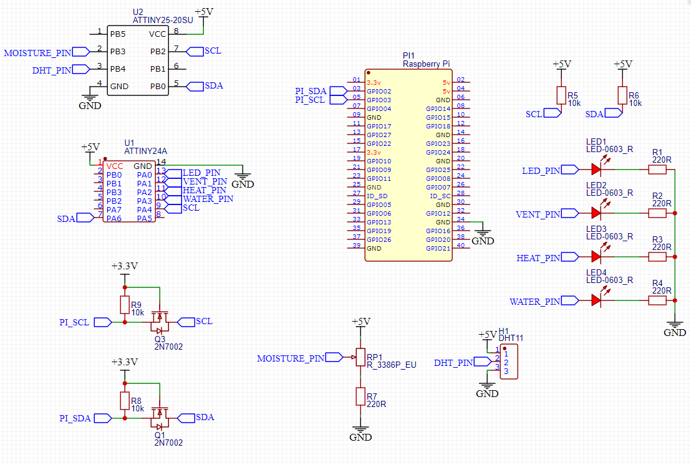

# Anticarium_IC

<!-- @import "[TOC]" {cmd="toc" depthFrom=1 depthTo=6 orderedList=false} -->

<!-- code_chunk_output -->

- [Anticarium_IC](#anticarium_ic)
  - [General](#general)
  - [I2C communication](#i2c-communication)
    - [ATTiny24A](#attiny24a)
    - [ATTiny25-20PU](#attiny25-20pu)
  - [Circuit](#circuit)
    - [Development attiny circuit](#development-attiny-circuit)
    - [Main circuit](#main-circuit)
  - [`development` folder](#development-folder)
  - [Instructions for ATTiny85](#instructions-for-attiny85)

<!-- /code_chunk_output -->

## General

This is electronic part of Anticarium project. Anticarium uses two MCUs, each of MCUs does one specific job, either it does input or output.

- ATTiny24A
    - Used for data output only
    - Four output pins:
        - PWM for LED
        - PWM for Ventilator
        - Pin for Water
        - Pin for Heat
- Attiny25-20PU
    - Used for data input only
    - Two input pins:
        - Pin for receiving data from DHT
        - ADC pin for reading analog soil moisture data         

## I2C communication

### ATTiny24A
- Slave
- Address: 0

To set value to output pins use following structure:
<`pin`><`value`>
Where:
- `pin` is of type `uint8_t`
- `value` if of type `uint8_t`

Example (in decimal):
`5` `255` sets the value of 255 to pin 5
`7` `0` turns off the pin number 7

Note that for PWM pins `value` must range between 0 and 255. For regular pins use 1 or 0 as value.

### ATTiny25-20PU
- Slave
- Address: 1

On each data request this MCU returns one of three values (humidity, moisture or temperature). On each request this MCU cycles through these three values. To distinguish the values, it sends first byte as ASCII identifier.

Identifier values and meanings:
- `h` - humidity [%]
- `m` - moisture [%]
- `t` - temperature [°C]

Next two bytes together make `int16_t` value. Note that these values ar multiplied by 100 to avoid floats and keep two decimals. To get the value, combine last two bytes of the message and divide the result by 100. Now you got correct float value.

Message looks like this:
<`identifier`><`value`>
Where:
- `identifier` is of type `uint8_t`
- `value` if of type `int16_t`

Example (in decimal):
`104` `29` `176` humidity 76%
`116` `9` `36` temperature 23.4°C

Note that if you send `int16_t` straight to I2C it may be converted to `uint8_t` incorrectly.

## Circuit

### Development attiny circuit

This is development circuit, it uses LEDs to show output. It also uses DHT temperature/humidity sensor and potentiometer for input. This circuit can be used as base for the main circuit. 

### Main circuit

This is main circuit that is used in Anticarium:

_In development_

## `development` folder

In `development` folder, you can find circuit that is similar to the circuit shown above. The `development` folder is used for prototyping main circuit and code for ATTinys, using more advanced microcontrollers that are easier to debug.     

## Instructions for ATTiny85

In default ATTiny85 does not work with DHT11 humidity/temperature sensor, because it operates in default 1MHZ preset frequency. To change that, you have to set ATTiny internal oscillator to 16MHZ using fuses. Correct fuse values are already provided in `src/attiny_input/platformio.ini` and you can use platformio set fuses command.   